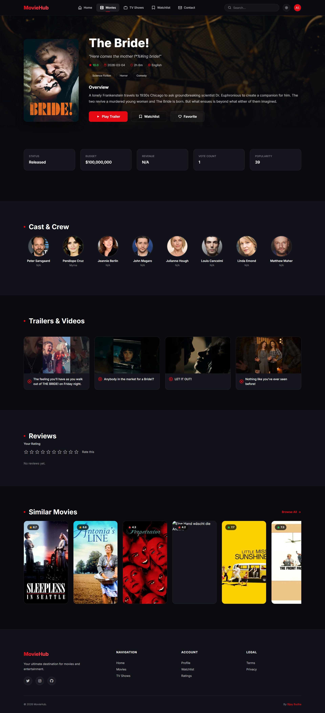
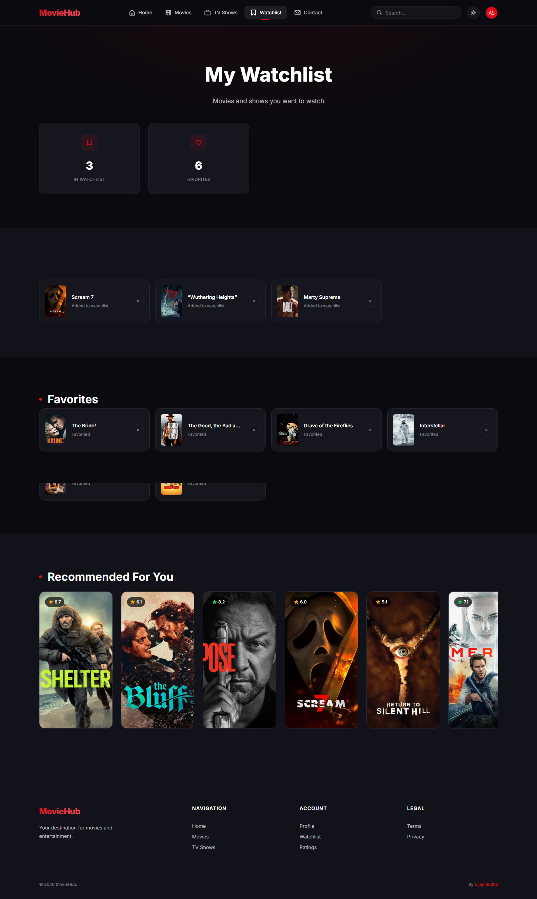
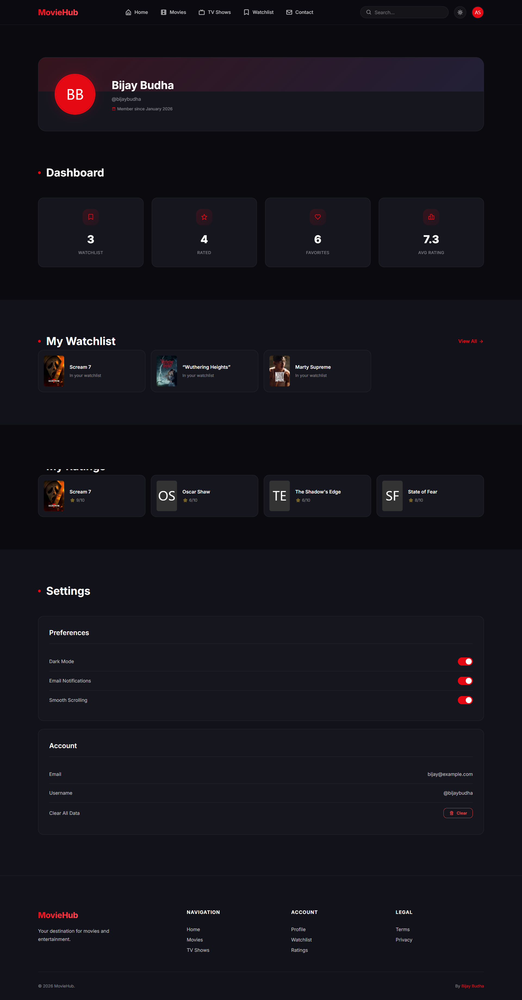
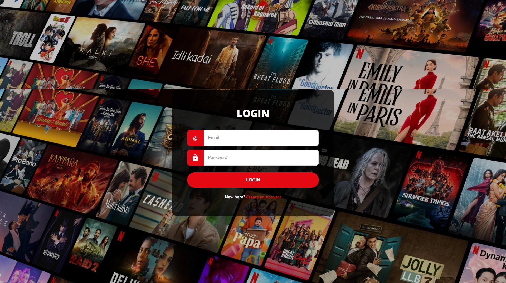
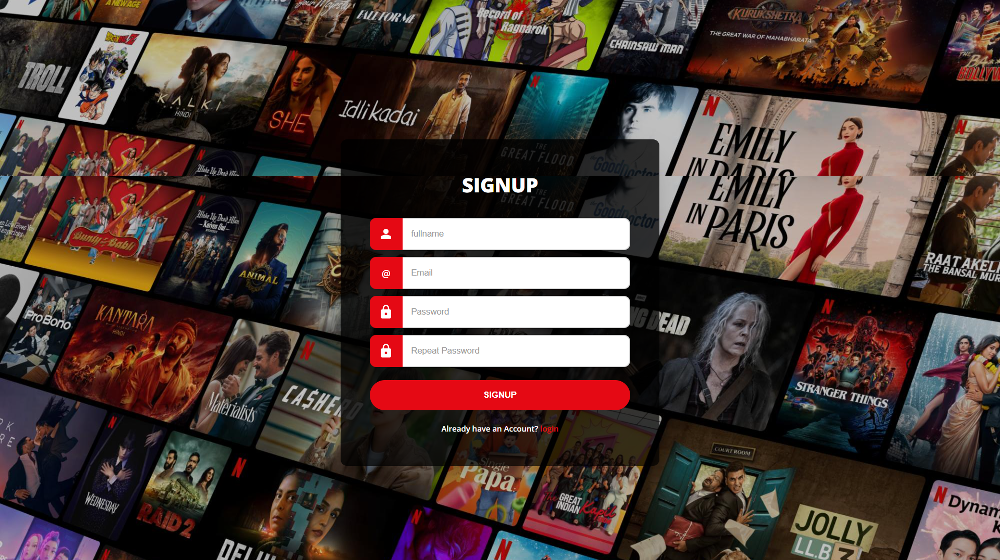
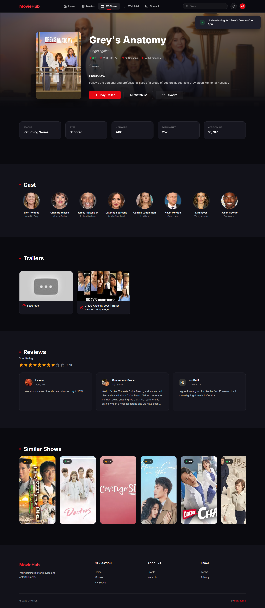
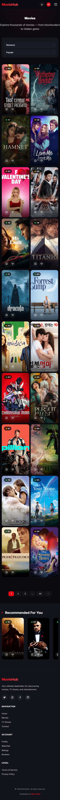

# 🎬 MovieHub - Film Information & Rating Website

<div align="center">

**A fully functional movie information and rating website built using HTML, CSS, and JavaScript**

[](https://developer.mozilla.org/en-US/docs/Web/HTML)
[](https://developer.mozilla.org/en-US/docs/Web/CSS)
[](https://developer.mozilla.org/en-US/docs/Web/JavaScript)

[Live Demo](#) • [Report Bug](https://github.com/bijaybudha-1/MovieHub/issues) • [Request Feature](https://github.com/bijaybudha-1/MovieHub/issues)

</div>

---

## 📋 Table of Contents

- [About The Project](#about-the-project)
- [Features](#features)
- [Project Preview](#project-preview)
- [Folder Structure](#folder-structure)
- [Tech Stack](#tech-stack)
- [Getting Started](#getting-started)
  - [Prerequisites](#prerequisites)
  - [Installation](#installation)
  - [Running the Project](#running-the-project)
- [Usage](#usage)
- [API Integration](#api-integration)
- [Project Pages](#project-pages)
- [JavaScript Modules](#javascript-modules)
- [Roadmap](#roadmap)
- [Contributing](#contributing)
- [License](#license)
- [Contact](#contact)
- [Acknowledgments](#acknowledgments)

---

## 🎯 About The Project

**MovieHub** is a comprehensive web-based application developed as part of a **university Web Design and Development assignment** at Techspire College, New Baneshwor. This platform provides movie enthusiasts with an intuitive interface to explore movies, TV shows, and series, complete with detailed information, user ratings, reviews, and personalized features.

The project showcases advanced frontend development skills including API integration, user authentication, profile management, and dynamic content rendering using vanilla JavaScript.

### 🎓 Academic Information

- **Project Name:** MovieHub - Film Information & Rating Website
- **Course:** Fundamentals of Web Design and Development
- **Student:** Bijay Budha
- **Institution:** Techspire College, New Baneshwor
- **Submission Year:** 2025

---

## ✨ Features

### 🎥 Core Functionality
- **Multi-Category Content**: Movies, TV Shows, and Series
- **API Integration**: Real-time data from movie databases
- **User Authentication**: Login and Registration system
- **User Profiles**: Personalized user profiles with avatar support
- **Rating System**: Interactive star-based rating functionality
- **Watchlist**: Add movies/shows to personal lists
- **Reviews**: Read and write user reviews
- **Detailed Information**: Comprehensive details for each movie/show/series
- **People Directory**: Information about actors, directors, and crew
- **Contact Form**: Get in touch with form validation

### 🎨 User Interface
- **Responsive Design**: Seamless experience across all devices
- **Image Slider**: Dynamic content carousel
- **Interactive Navigation**: Smooth page transitions
- **Professional Layout**: Clean and modern UI design
- **Background Themes**: Engaging visual backgrounds
- **Avatar System**: Custom user profile images

### 🔧 Technical Features
- **Form Validation**: Client-side validation for all forms
- **Dynamic Content Loading**: API-driven content updates
- **Modular JavaScript**: Organized code structure
- **Session Management**: User session handling
- **Component Includes**: Reusable HTML components
- **Profile Persistence**: Fixed profile functionality
- **Search Functionality**: Find content quickly

---

## 📸 Project Preview

### Homepage

*Main landing page featuring trending movies and navigation*

### Home Section

*Browse through extensive movie collection with API integration*

### Movie Details

*Detailed information including cast, ratings, and reviews*

### TV Shows

*Explore popular TV shows and series*

### Watchlist

*Complete information about TV series with episode guides*

### User Profile

*Personalized user profile with watchlist and preferences*

### Login/Register
<div align="center">
  
  
</div>

*User authentication system with form validation*

### Rating the Movie

*Interactive 5-star rating interface*


### Mobile Responsive
<div align="center">
  

</div>

*Fully responsive design across all devices*

---

## 📂 Folder Structure

```

MovieHub/
│
├── index.html                          # 🏠 Homepage
│
├── pages/                              # 📄 All HTML Pages
│   ├── login.html
│   ├── register.html
│   ├── movies.html
│   ├── movie-details.html
│   ├── tvshows.html
│   ├── tv-details.html
│   ├── ratings.html
│   ├── reviews.html
│   ├── watchlist.html
│   ├── profile.html
│   └── contact.html
│
├── js/                                 # ⚙️ JavaScript (Main Logic)
│   ├── main.js
│   ├── api.js
│   ├── home.js
│   ├── movies-page.js
│   ├── movie-details-page.js
│   ├── tvshows-page.js
│   ├── tv-details-page.js
│   ├── ratings-page.js
│   ├── reviews-page.js
│   ├── watchlist.js
│   ├── watchlist-page.js
│   ├── profile-page.js
│   ├── login-page.js
│   ├── register-page.js
│   ├── contact-page.js
│   ├── search.js
│   ├── rating.js
│   └── animation.js
│
├── css/                                # 🎨 Stylesheets (Main)
│   ├── style.css
│   ├── components.css
│   ├── responsive.css
│   └── animations.css
│
├── assets/                             # 📦 Static Assets
│   ├── CSS/
│   │   └── style.css
│   ├── js/
│   │   ├── main.js
│   │   ├── movieApi.js
│   │   ├── movieDetails.js
│   │   ├── seriesApi.js
│   │   ├── seriesDetails.js
│   │   ├── tvShowsApi.js
│   │   ├── tvShowsDetails.js
│   │   ├── profile.js
│   │   ├── profile-fixed.js
│   │   ├── form-validation.js
│   │   ├── include.js
│   │   ├── rating.js
│   │   └── slider.js
│   └── images/
│       ├── image.png
│       ├── avatar-images.avif
│       └── login-bg-images.jpg
│
├── docs/                               # 📸 Screenshots & Docs
│   └── screenshots/
│       ├── homepage.png
│       ├── login.png
│       ├── register.png
│       ├── movie-page.png
│       ├── movie-details.png
│       ├── series-details.png
│       ├── tv-shows.png.png
│       ├── watchlist.png
│       ├── profile.png
│       ├── mobile-home.png
│       └── mobile-movies.png
│
├── movies.html                         # (root-level duplicate)
├── .vscode/
│   └── settings.json
└── README.md

```

---

## 🛠️ Tech Stack

### Frontend Technologies

| Technology | Purpose | Details |
|------------|---------|---------|
| **HTML5** | Structure & Markup | Semantic elements, forms |
| **CSS3** | Styling & Layout | Responsive design, animations |
| **JavaScript (ES6)** | Functionality & Logic | Vanilla JS, ES6+ features |

### APIs & External Services

| Service | Purpose |
|---------|---------|
| **Movie Database API** | Fetch movie data, ratings, details |
| **TV Shows API** | Retrieve TV show information |
| **Series API** | Access series data and episodes |

### Development Tools

| Tool | Purpose |
|------|---------|
| **Visual Studio Code** | Primary code editor |
| **Git** | Version control |
| **GitHub** | Repository hosting |
| **Browser DevTools** | Debugging & testing |

### Key JavaScript Features
- ✅ API Integration (Fetch API)
- ✅ DOM Manipulation
- ✅ Event Handling
- ✅ Form Validation
- ✅ Local Storage
- ✅ Dynamic Content Rendering
- ✅ Modular Code Architecture
- ✅ Async/Await Operations

### CSS Features
- ✅ Responsive Design
- ✅ Flexbox & Grid
- ✅ CSS Variables
- ✅ Transitions & Animations
- ✅ Media Queries
- ✅ Custom Styling

---

## 🚀 Getting Started

Follow these instructions to set up the project locally.

### Prerequisites

Ensure you have the following:

- **Web Browser** (Chrome, Firefox, Safari, or Edge - latest version)
- **Code Editor** (VS Code recommended)
- **Git** (for cloning the repository)
- **API Key** (if using external movie APIs)

Optional:
- **Live Server Extension** (for VS Code)
- **Local Web Server** (XAMPP, WAMP, or similar)

### Installation

1. **Clone the Repository**

   ```bash
   git clone https://github.com/bijaybudha-1/MovieHub.git
   ```

2. **Navigate to Project Directory**

   ```bash
   cd MovieHub
   ```

3. **Configure API Keys** (if required)

   - Open relevant API files (`movieApi.js`, `seriesApi.js`, `tvShowsApi.js`)
   - Add your API keys where indicated
   
   ```javascript
   // Example in movieApi.js
   const API_KEY = 'your_api_key_here';
   const BASE_URL = 'https://api.example.com';
   ```

4. **Open in Code Editor**

   ```bash
   code .
   ```

### Running the Project

#### Method 1: Using Live Server (Recommended)

1. Install "Live Server" extension in VS Code
2. Right-click on `movies.html` or `index.html`
3. Select "Open with Live Server"
4. Browser opens at `http://localhost:5500`

#### Method 2: Direct File Opening

1. Navigate to project folder
2. Double-click `movies.html` (or `index.html`)
3. Opens in default browser

#### Method 3: Local Server

1. Place project in server directory:
   - **XAMPP**: `htdocs/MovieHub`
   - **WAMP**: `www/MovieHub`

2. Start server and access:
   ```
   http://localhost/MovieHub/movies.html
   ```

---

## 💡 Usage

### Navigation Flow

1. **Homepage/Movies Page** (`movies.html`)
   - Browse featured movies
   - View trending content
   - Access different categories

2. **Authentication**
   - **Register** (`pages/register.html`) - Create new account
   - **Login** (`pages/login.html`) - Access existing account
   - Form validation ensures data integrity

3. **Content Exploration**
   - **Movies** (`movies.html`) - Browse all movies
   - **TV Shows** (`pages/tv-shows.html`) - Explore TV content
   - **Series** (`pages/series.html`) - Discover series

4. **Detailed Views**
   - **Movie Details** (`pages/movies-details.html`)
   - **Series Details** (`pages/seriesDetails.html`)
   - **TV Show Details** (`pages/tvshowDetails.html`)
   - View cast, ratings, trailers, and more

5. **User Features**
   - **Profile** (`pages/profile.html`) - Manage account
   - **Watchlist** (`pages/addToList.html`) - Save favorites
   - **Ratings** (`pages/ratings.html`) - Rate content
   - **Reviews** (`pages/reviews.html`) - Write reviews

6. **Additional Pages**
   - **People** (`pages/people.html`) - Cast & crew info
   - **Contact** (`pages/contact.html`) - Get in touch

---

## 🔌 API Integration

### Movie API (`movieApi.js`)
```javascript
// Fetches movie data from external API
// Handles movie listings, search, and filtering
// Returns movie objects with details
```

### Series API (`seriesApi.js`)
```javascript
// Retrieves series information
// Manages episode data
// Handles series-specific queries
```

### TV Shows API (`tvShowsApi.js`)
```javascript
// Fetches TV show data
// Manages show schedules
// Returns show details and episodes
```

### API Setup Instructions

1. **Get API Key**
   - Sign up at your chosen movie database API provider
   - Obtain API credentials

2. **Configure Keys**
   - Add keys to respective API files
   - Set base URLs and endpoints

3. **Test Connection**
   - Run the application
   - Verify data loads correctly

---

## 📄 Project Pages

### Core Pages

| Page | File | Description |
|------|------|-------------|
| **Movies Home** | `movies.html` | Main movies listing page |
| **Movie Details** | `pages/movies-details.html` | Individual movie information |
| **TV Shows** | `pages/tv-shows.html` | TV shows catalog |
| **TV Show Details** | `pages/tvshowDetails.html` | TV show information |
| **Series** | `pages/series.html` | Series catalog |
| **Series Details** | `pages/seriesDetails.html` | Series information |

### User Management

| Page | File | Description |
|------|------|-------------|
| **Login** | `pages/login.html` | User authentication |
| **Register** | `pages/register.html` | New user signup |
| **Profile** | `pages/profile.html` | User account management |

### Features

| Page | File | Description |
|------|------|-------------|
| **Watchlist** | `pages/addToList.html` | Save movies/shows |
| **Ratings** | `pages/ratings.html` | Rate content |
| **Reviews** | `pages/reviews.html` | User reviews |
| **People** | `pages/people.html` | Cast & crew directory |
| **Contact** | `pages/contact.html` | Contact form |

---

## 📜 JavaScript Modules

### Core Modules

| File | Purpose |
|------|---------|
| `main.js` | Main application logic and initialization |
| `include.js` | Dynamic HTML component inclusion |
| `slider.js` | Image carousel/slider functionality |

### API Integration

| File | Purpose |
|------|---------|
| `movieApi.js` | Movie data API calls |
| `seriesApi.js` | Series data API integration |
| `tvShowsApi.js` | TV shows API handling |

### Feature Modules

| File | Purpose |
|------|---------|
| `movieDetails.js` | Movie detail page functionality |
| `seriesDetails.js` | Series detail page logic |
| `tvShowsDetails.js` | TV show detail features |
| `rating.js` | Star rating system |
| `profile.js` | User profile management |
| `profile-fixed.js` | Fixed profile features |
| `form-validation.js` | Form validation logic |

---

## 🗺️ Roadmap

### Completed Features ✅
- [x] Multi-page navigation structure
- [x] Movie API integration
- [x] TV Shows & Series support
- [x] User authentication system
- [x] Profile management
- [x] Rating system
- [x] Reviews functionality
- [x] Watchlist feature
- [x] Form validation
- [x] Responsive design
- [x] Image slider/carousel
- [x] Modular JavaScript architecture

### In Progress 🚧
- [ ] Enhanced search functionality
- [ ] Advanced filtering options
- [ ] Social sharing features
- [ ] Dark mode toggle

### Future Enhancements 🚀
- [ ] Backend database integration
- [ ] User comments system
- [ ] Recommendation algorithm
- [ ] Video trailer integration
- [ ] Advanced user profiles
- [ ] Notification system
- [ ] Social features (follow users)
- [ ] Mobile app version
- [ ] Progressive Web App (PWA)
- [ ] Accessibility improvements (WCAG)
- [ ] Multi-language support
- [ ] Advanced analytics

---

## 🤝 Contributing

Contributions make the open-source community an amazing place to learn and create. Any contributions are **greatly appreciated**.

### How to Contribute

1. **Fork the Project**
2. **Create Feature Branch**
   ```bash
   git checkout -b feature/AmazingFeature
   ```
3. **Commit Changes**
   ```bash
   git commit -m "Add some AmazingFeature"
   ```
4. **Push to Branch**
   ```bash
   git push origin feature/AmazingFeature
   ```
5. **Open Pull Request**

### Contribution Guidelines

- Follow existing code style
- Add comments for complex logic
- Test thoroughly before submitting
- Update documentation as needed
- Be respectful in discussions

---

## 📜 License

This project is created for **educational purposes only** and is **not intended for commercial use**.

All movie posters, images, and related media belong to their respective copyright holders. This is a demonstration project for academic assessment.

### Usage Terms
- ✅ Free for educational purposes
- ✅ Can be forked for learning
- ❌ Not for commercial use
- ❌ Media assets remain copyrighted

---

## 📧 Contact

**Bijay Budha** - Full Stack Web Developer

[](mailto:bijaybudha48@gmail.com)
[](https://github.com/bijaybudha-1)
[](https://www.linkedin.com/in/bijay-budha/)
[](https://www.instagram.com/dev_loper.bijay/)

### Get in Touch

- 📧 **Email:** bijaybudha48@gmail.com
- 🌐 **GitHub:** [github.com/bijaybudha-1](https://github.com/bijaybudha-1)
- 💼 **LinkedIn:** [linkedin.com/in/bijay-budha](https://www.linkedin.com/in/bijay-budha/)
- 📸 **Instagram:** [@dev_loper.bijay](https://www.instagram.com/dev_loper.bijay/)

**Project Link:** [https://github.com/bijaybudha-1/MovieHub](https://github.com/bijaybudha-1/MovieHub)

---

## 🙏 Acknowledgments

### Special Thanks

- **Techspire College** - Educational guidance
- **Course Instructors** - Valuable feedback
- **Movie Database APIs** - Content providers
- **Open Source Community** - Resources and inspiration

### Resources Used

- [Font Awesome](https://fontawesome.com/) - Icons
- [Google Fonts](https://fonts.google.com/) - Typography
- [MDN Web Docs](https://developer.mozilla.org/) - Documentation
- [W3Schools](https://www.w3schools.com/) - Tutorials
- [Stack Overflow](https://stackoverflow.com/) - Problem solving
- [CSS-Tricks](https://css-tricks.com/) - CSS techniques
- [JavaScript.info](https://javascript.info/) - JS learning

### APIs & Services

- Movie Database API
- TV Shows Database
- Series Information API
- Image Hosting Services

---

## 💭 Developer's Note

> "MovieHub represents my journey in mastering web development fundamentals—from semantic HTML and responsive CSS to advanced JavaScript and API integration. This project demonstrates not only technical skills but also a passion for creating user-centric web applications that bring the world of cinema to life."
> 
> — Bijay Budha

---

## 📊 Project Statistics

- **Total Pages:** 15+
- **JavaScript Modules:** 13
- **API Integrations:** 3
- **Development Time:** 8 weeks
- **Languages:** HTML, CSS, JavaScript
- **Features:** Authentication, Profiles, Ratings, Reviews, Watchlist
- **Responsive:** Mobile, Tablet, Desktop

---

## 🔧 Browser Support

| Browser | Version | Status |
|---------|---------|--------|
| Chrome | Latest | ✅ Fully Supported |
| Firefox | Latest | ✅ Fully Supported |
| Safari | Latest | ✅ Fully Supported |
| Edge | Latest | ✅ Fully Supported |
| Opera | Latest | ✅ Supported |

---

## 📱 Responsive Breakpoints

```css
/* Mobile First Approach */
Mobile:  320px - 767px
Tablet:  768px - 1024px
Desktop: 1025px and above
```

---

## 🔑 Key Features Summary

### User Experience
- ✅ User authentication (Login/Register)
- ✅ Personalized profiles with avatars
- ✅ Watchlist management
- ✅ Rating system
- ✅ Review submission

### Content
- ✅ Movies database
- ✅ TV Shows catalog
- ✅ Series information
- ✅ People directory (cast/crew)
- ✅ Detailed information pages

### Technical
- ✅ API integration
- ✅ Form validation
- ✅ Modular JavaScript
- ✅ Responsive design
- ✅ Dynamic content loading
- ✅ Component reusability

---

<div align="center">

### ⭐ If you found this project helpful, please give it a star!

**Made with ❤️ by Bijay Budha**

[⬆ Back to Top](#-moviehub---film-information--rating-website)

</div>

---

**Last Updated:** March 2026  
**Version:** 1.9.3  
**Status:** Active Development